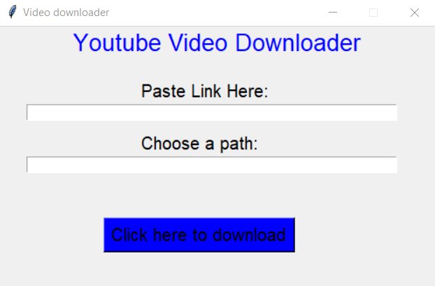

# Youtube video downloader using Python.
This is a python script that enables you to download a youtube video using a GUI.
# Libraries needed
<ul style="list-style-type:disc"> 
  <li> <strong>Tkinter</strong>: the standard Python interface to the Tcl/Tk GUI toolkit.
  <li> <strong>Pytybe</strong>: a lightweight, Pythonic, dependency-free, library (and command-line utility) for downloading YouTube Videos. 
</ul>

   
